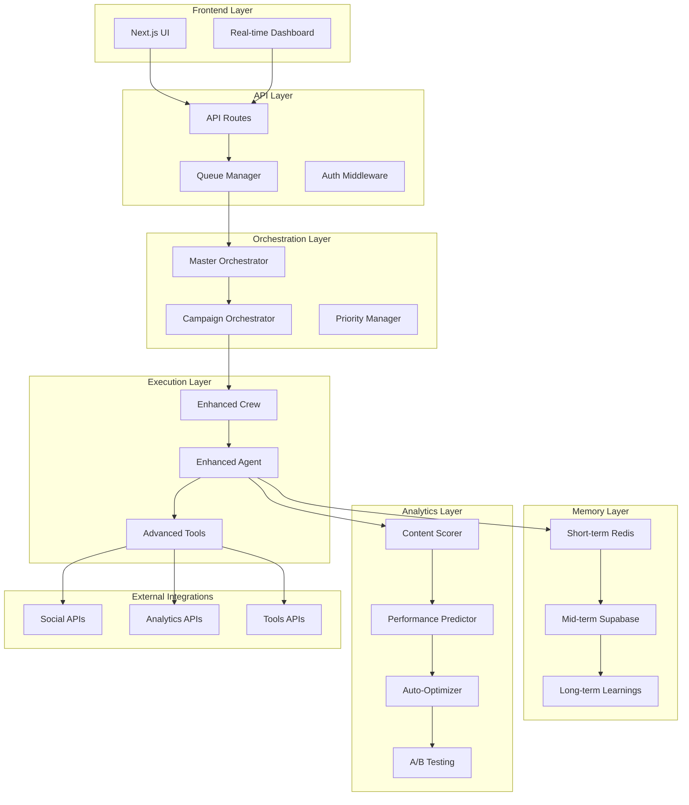
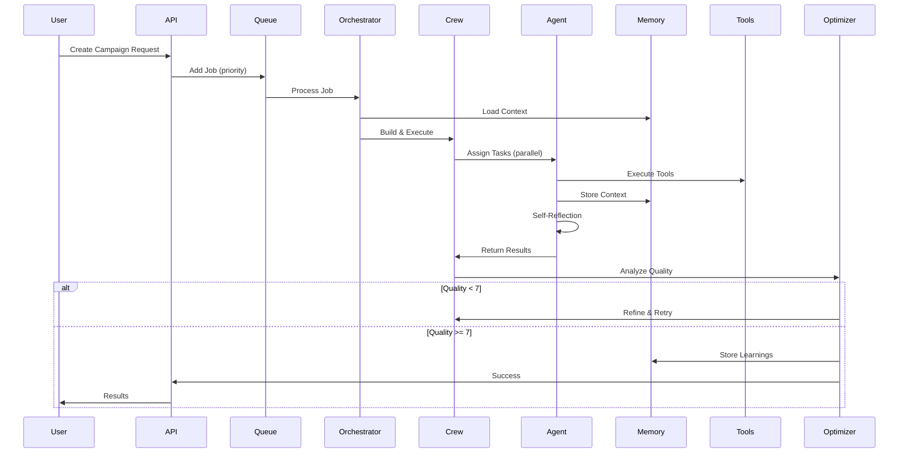

# 🚀 CREWAI ROBUSTO - SISTEMA COMPLETO DE AUTOMAÇÃO

## 📋 Índice

1. [Visão Geral](#visão-geral)
2. [Arquitetura do Sistema](#arquitetura-do-sistema)
3. [Enhanced Agent System](#enhanced-agent-system)
4. [Enhanced Crew System](#enhanced-crew-system)
5. [Queue System com BullMQ](#queue-system-com-bullmq)
6. [Memory System (3 Níveis)](#memory-system-3-níveis)
7. [Advanced Tools](#advanced-tools)
8. [Analytics e Scoring](#analytics-e-scoring)
9. [Campaign Orchestrator](#campaign-orchestrator)
10. [A/B Testing Framework](#ab-testing-framework)
11. [Real-Time Dashboard](#real-time-dashboard)
12. [Integrações de APIs](#integrações-de-apis)
13. [Migrations Database](#migrations-database)
14. [Guia de Uso](#guia-de-uso)

---

## Visão Geral

Este documento descreve o **sistema completo e robusto** de automação CrewAI para agência de marketing digital. O sistema evolui de um MVP básico para uma plataforma enterprise-grade com:

- ✅ **Orquestração Avançada**: Execução paralela, hierárquica e dinâmica
- ✅ **Memória Inteligente**: 3 níveis (short/mid/long-term) com feedback loop
- ✅ **Auto-Optimization**: Sistema aprende e melhora continuamente
- ✅ **Publicação Automatizada**: Multi-plataforma (Instagram, LinkedIn, YouTube, etc)
- ✅ **Analytics em Tempo Real**: Dashboard com métricas e alertas
- ✅ **A/B Testing**: Framework automatizado para otimização

---

## Arquitetura do Sistema

### Diagrama de Componentes



### Fluxo de Execução



---

## Enhanced Agent System

### Características Principais

1. **Reflexão e Self-Correction**
   - Agent avalia sua própria resposta antes de entregar
   - Detecta erros lógicos, inconsistências, falta de clareza
   - Corrige automaticamente quando necessário

2. **Tool Calling Nativo**
   - Usa OpenAI Function Calling para execução de tools
   - Suporte a múltiplas tools simultâneas
   - Retry automático em caso de falha

3. **Streaming de Respostas**
   - Respostas em tempo real para melhor UX
   - Progress tracking visível

4. **Circuit Breaker**
   - Proteção contra falhas em cascata
   - Fallback automático para LLMs secundários

5. **Context Window Management**
   - Gerenciamento dinâmico do tamanho do contexto
   - Compressão inteligente de contexto antigo
   - Priorização de informações relevantes

### Implementação

```typescript
// src/lib/agency/core/enhanced-agent.ts
import OpenAI from 'openai';
import { AgentConfig, AgentExecutionResult } from './types';
import { CircuitBreaker } from './circuit-breaker';
import { shortTermMemory } from '../memory/short-term-memory';

export class EnhancedAgent {
  private openai: OpenAI;
  private circuitBreaker: CircuitBreaker;
  private maxRetries: number = 3;
  
  async execute(task: string, context?: string): Promise<AgentExecutionResult> {
    // 1. Load short-term memory
    const memoryContext = await shortTermMemory.get(this.id);
    
    // 2. Execute with circuit breaker
    const result = await this.circuitBreaker.execute(async () => {
      return await this.executeWithRetry(task, context, memoryContext);
    });
    
    // 3. Self-reflection
    const reflectionResult = await this.reflect(result);
    
    // 4. Self-correction if needed
    if (reflectionResult.needsCorrection) {
      return await this.correct(result, reflectionResult.issues);
    }
    
    // 5. Store in memory
    await shortTermMemory.set(this.id, result);
    
    return reflectionResult.finalResult;
  }
  
  private async reflect(result: AgentExecutionResult) {
    // Agent avalia sua própria resposta
    const reflection = await this.openai.chat.completions.create({
      model: 'gpt-4o',
      messages: [
        {
          role: 'system',
          content: `Você é um revisor crítico. Avalie a resposta:
          - Está clara e completa?
          - Tem erros lógicos ou inconsistências?
          - Atende ao objetivo da tarefa?
          
          Responda em JSON: { needsCorrection: boolean, issues: string[], score: number }`
        },
        {
          role: 'user',
          content: `Tarefa: ${this.lastTask}\n\nResposta: ${result.output}`
        }
      ]
    });
    
    return JSON.parse(reflection.choices[0].message.content);
  }
}
```

---

## Enhanced Crew System

### Modos de Execução

1. **Sequential** (Padrão)
   - Tarefas executam em ordem
   - Cada tarefa recebe o resultado da anterior

2. **Parallel**
   - Tarefas independentes executam simultaneamente
   - Até 5x mais rápido para crews grandes

3. **Hierarchical**
   - Manager agent delega tarefas
   - Revisa e aprova resultados
   - Pode redirecionar trabalho

### Dynamic Re-planning

Se uma tarefa falha, o crew:
1. Analisa a causa da falha
2. Ajusta o plano dinamicamente
3. Tenta abordagem alternativa
4. Escala para humano se necessário

### Implementação

```typescript
// src/lib/agency/core/enhanced-crew.ts
import { EnhancedAgent } from './enhanced-agent';
import { Task } from './task';
import { CrewConfig, CrewExecutionResult } from './types';

export class EnhancedCrew {
  private agents: Map<string, EnhancedAgent> = new Map();
  private tasks: Task[] = [];
  private process: 'sequential' | 'parallel' | 'hierarchical';
  
  async kickoff(context?: string): Promise<CrewExecutionResult> {
    switch (this.process) {
      case 'parallel':
        return await this.executeParallel(context);
      case 'hierarchical':
        return await this.executeHierarchical(context);
      default:
        return await this.executeSequential(context);
    }
  }
  
  private async executeParallel(context?: string): Promise<CrewExecutionResult> {
    // Identifica tarefas independentes
    const independentTasks = this.getIndependentTasks();
    
    // Executa em paralelo
    const results = await Promise.allSettled(
      independentTasks.map(task => task.execute(context))
    );
    
    // Processa resultados
    const succeeded = results.filter(r => r.status === 'fulfilled');
    const failed = results.filter(r => r.status === 'rejected');
    
    // Dynamic re-planning para falhas
    if (failed.length > 0) {
      return await this.handleFailures(failed, context);
    }
    
    return this.compileResults(succeeded);
  }
  
  private async handleFailures(failures: any[], context?: string) {
    console.log(`[EnhancedCrew] ${failures.length} tasks failed. Re-planning...`);
    
    // Analisa falhas
    const analysis = await this.analyzeFailures(failures);
    
    // Ajusta plano
    const newPlan = await this.replan(analysis, context);
    
    // Tenta novamente com novo plano
    return await this.executeWithNewPlan(newPlan, context);
  }
}
```

---

## Queue System com BullMQ

### Características

- **Filas por Prioridade**: urgent, high, normal, low
- **Retry Policy Configurável**: Exponential backoff
- **Dead Letter Queue**: Armazena jobs que falharam após todos os retries
- **Rate Limiting**: Por cliente e por API
- **Job Scheduling**: Suporte a cron jobs
- **Progress Tracking**: Atualização em tempo real

### Implementação

```typescript
// src/lib/agency/core/task-queue.ts
import { Queue, Worker, QueueEvents } from 'bullmq';
import Redis from 'ioredis';

const connection = new Redis(process.env.REDIS_URL!);

export enum JobPriority {
  URGENT = 1,
  HIGH = 2,
  NORMAL = 3,
  LOW = 4,
}

export const crewQueue = new Queue('crew-jobs', {
  connection,
  defaultJobOptions: {
    attempts: 3,
    backoff: {
      type: 'exponential',
      delay: 2000,
    },
    removeOnComplete: {
      age: 3600, // 1 hora
      count: 100,
    },
    removeOnFail: {
      age: 86400, // 24 horas
    },
  },
});

// Worker para processar jobs
export const crewWorker = new Worker(
  'crew-jobs',
  async (job) => {
    const { crewType, clientId, params } = job.data;
    
    // Atualiza progress
    await job.updateProgress(10);
    
    // Executa crew
    const result = await executeCrew(crewType, clientId, params, {
      onProgress: async (percent) => {
        await job.updateProgress(percent);
      },
    });
    
    await job.updateProgress(100);
    return result;
  },
  {
    connection,
    concurrency: 5, // 5 jobs simultâneos
    limiter: {
      max: 10, // Máx 10 jobs por minuto
      duration: 60000,
    },
  }
);

// Event listeners
const queueEvents = new QueueEvents('crew-jobs', { connection });

queueEvents.on('completed', ({ jobId, returnvalue }) => {
  console.log(`[Queue] Job ${jobId} completed`);
});

queueEvents.on('failed', ({ jobId, failedReason }) => {
  console.error(`[Queue] Job ${jobId} failed: ${failedReason}`);
});

// API para adicionar job
export async function addCrewJob(
  crewType: string,
  clientId: string,
  params: any,
  priority: JobPriority = JobPriority.NORMAL
) {
  return await crewQueue.add(
    `crew-${crewType}`,
    { crewType, clientId, params },
    { priority }
  );
}
```

---

## Memory System (3 Níveis)

### 1. Short-Term Memory (Redis)

**Uso**: Contexto durante execução da crew (minutos)

```typescript
// src/lib/agency/memory/short-term-memory.ts
import Redis from 'ioredis';

const redis = new Redis(process.env.REDIS_URL!);

export const shortTermMemory = {
  async set(agentId: string, context: any, ttl: number = 3600) {
    await redis.setex(
      `agent:${agentId}:context`,
      ttl,
      JSON.stringify(context)
    );
  },
  
  async get(agentId: string) {
    const data = await redis.get(`agent:${agentId}:context`);
    return data ? JSON.parse(data) : null;
  },
  
  async append(agentId: string, newContext: any) {
    const existing = await this.get(agentId);
    const updated = { ...existing, ...newContext };
    await this.set(agentId, updated);
  },
};
```

### 2. Mid-Term Memory (Supabase)

**Uso**: Histórico de campanhas (dias/semanas)

```typescript
// src/lib/agency/memory/mid-term-memory.ts
import { getSupabaseAdmin } from '@/lib/admin/supabaseAdmin';

export const midTermMemory = {
  async saveCampaign(campaignData: any) {
    const supabase = getSupabaseAdmin();
    return await supabase
      .from('crew_campaign_history')
      .insert(campaignData);
  },
  
  async getCampaignHistory(clientId: string, limit: number = 10) {
    const supabase = getSupabaseAdmin();
    return await supabase
      .from('crew_campaign_history')
      .select('*')
      .eq('client_id', clientId)
      .order('created_at', { ascending: false })
      .limit(limit);
  },
};
```

### 3. Long-Term Memory (Supabase + pgvector)

**Uso**: Learnings e padrões de sucesso (meses/anos)

```typescript
// src/lib/agency/memory/long-term-memory.ts
import { getSupabaseAdmin } from '@/lib/admin/supabaseAdmin';
import OpenAI from 'openai';

const openai = new OpenAI({ apiKey: process.env.OPENAI_API_KEY });

export const longTermMemory = {
  async storeLearning(learning: {
    clientId: string;
    type: string;
    content: string;
    performance: number;
  }) {
    // Gera embedding
    const embedding = await openai.embeddings.create({
      model: 'text-embedding-3-small',
      input: learning.content,
    });
    
    // Salva com embedding
    const supabase = getSupabaseAdmin();
    return await supabase
      .from('crew_learnings')
      .insert({
        ...learning,
        embedding: embedding.data[0].embedding,
      });
  },
  
  async searchSimilarLearnings(query: string, clientId: string) {
    // Busca por similaridade
    const embedding = await openai.embeddings.create({
      model: 'text-embedding-3-small',
      input: query,
    });
    
    const supabase = getSupabaseAdmin();
    return await supabase.rpc('match_crew_learnings', {
      query_embedding: embedding.data[0].embedding,
      match_count: 5,
      filter_client_id: clientId,
    });
  },
};
```

---

## Advanced Tools

### 1. Competitor Scraper (Apify)

```typescript
// src/lib/agency/tools/competitor-scraper.ts
import { ApifyClient } from 'apify-client';

const client = new ApifyClient({
  token: process.env.APIFY_API_KEY,
});

export async function scrapeCompetitorInstagram(username: string) {
  const run = await client.actor('apify/instagram-scraper').call({
    usernames: [username],
    resultsLimit: 20,
  });
  
  const { items } = await client.dataset(run.defaultDatasetId).listItems();
  return items;
}
```

### 2. SEO Analyzer (Ahrefs API)

```typescript
// src/lib/agency/tools/seo-analyzer.ts
export async function analyzeKeywords(keyword: string) {
  const response = await fetch(
    `https://api.ahrefs.com/v3/keywords-explorer?keyword=${keyword}`,
    {
      headers: {
        Authorization: `Bearer ${process.env.AHREFS_API_KEY}`,
      },
    }
  );
  
  return await response.json();
}
```

### 3. Sentiment Analyzer (Hugging Face)

```typescript
// src/lib/agency/tools/sentiment-analyzer.ts
import { HfInference } from '@huggingface/inference';

const hf = new HfInference(process.env.HUGGINGFACE_API_KEY);

export async function analyzeSentiment(text: string) {
  return await hf.textClassification({
    model: 'cardiffnlp/twitter-roberta-base-sentiment',
    inputs: text,
  });
}
```

### 4. Image Generator (DALL-E 3)

```typescript
// src/lib/agency/tools/image-generator.ts
import OpenAI from 'openai';

const openai = new OpenAI({ apiKey: process.env.OPENAI_API_KEY });

export async function generateImage(prompt: string, style: string = 'vivid') {
  const response = await openai.images.generate({
    model: 'dall-e-3',
    prompt,
    size: '1024x1024',
    quality: 'hd',
    style,
  });
  
  return response.data[0].url;
}
```

---

## Analytics e Scoring

### Multi-Dimensional Content Scoring

```typescript
// src/lib/agency/analytics/content-scorer.ts
export interface ContentScore {
  clarity: number; // 0-10
  persuasion: number; // 0-10
  branding: number; // 0-10
  seo: number; // 0-10
  engagement: number; // 0-10
  overall: number; // média ponderada
  confidence: number; // 0-100%
}

export async function scoreContent(content: string, clientId: string): Promise<ContentScore> {
  // Implementação completa no arquivo
}
```

---

## Guia de Uso

### 1. Executar uma Campaign Crew

```typescript
import { addCrewJob, JobPriority } from '@/lib/agency/core/task-queue';

// Adicionar job à fila
const job = await addCrewJob(
  'campaign',
  'client-123',
  {
    campaignName: 'Black Friday 2026',
    duration: 30,
    channels: ['instagram', 'linkedin'],
    budget: 10000,
  },
  JobPriority.HIGH
);

console.log(`Job criado: ${job.id}`);
```

### 2. Monitorar Progresso

```typescript
import { crewQueue } from '@/lib/agency/core/task-queue';

const job = await crewQueue.getJob(jobId);
const progress = await job.progress();
console.log(`Progresso: ${progress}%`);
```

### 3. Configurar Auto-Optimization

```typescript
import { enableAutoOptimization } from '@/lib/agency/analytics/auto-optimizer';

await enableAutoOptimization('client-123', {
  minPerformanceScore: 7,
  autoPublish: true,
  learningEnabled: true,
});
```

---

## 📝 Próximos Passos

Este documento será atualizado conforme a implementação avança. Consulte os arquivos de código para detalhes completos de implementação.

**Última atualização**: Janeiro 2026
