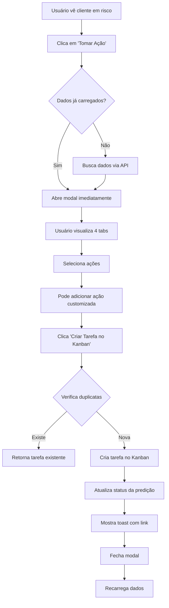

# ✅ Implementação Completa: Botão "Tomar Ação" - Sistema de Retenção de Clientes

## 📋 Resumo da Implementação

Foi implementado um sistema completo de ações de retenção para clientes em risco de churn, integrando:

1. **Modal interativo** com 4 tabs de informações
2. **API route** para criar tarefas no Kanban
3. **Integração** em 2 páginas diferentes
4. **Sistema de idempotência** para evitar tarefas duplicadas

---

## 🎯 Arquivos Criados/Modificados

### ✨ Novos Arquivos

1. **`src/components/predictions/ChurnActionModal.tsx`**
   - Componente modal completo com UI rica
   - 4 tabs: Visão Geral, Sinais de Alerta, Ações Recomendadas, Fatores
   - Sistema de seleção de ações com checkboxes
   - Campo para adicionar ações customizadas
   - Integração com API para criar tarefas

2. **`src/app/api/admin/predictions/actions/create/route.ts`**
   - API POST para criar tarefas de retenção
   - Validações de permissões (super_admin)
   - Sistema de idempotência (evita tarefas duplicadas em 24h)
   - Prioridade automática baseada em risk_level
   - Atualização do status da predição
   - Descrição detalhada com todas as informações relevantes

### 📝 Arquivos Modificados

3. **`src/app/admin/predictions/page.tsx`**
   - Adicionado estados: `selectedClient`, `showActionModal`
   - Adicionado onClick no botão "Tomar Ação"
   - Renderização do `ChurnActionModal`
   - Recarga de dados após criar tarefa

4. **`src/app/admin/predictions/churn/page.tsx`**
   - Adicionado estados: `selectedPrediction`, `showActionModal`
   - Adicionado onClick no botão "Iniciar Retenção"
   - Implementado botão "Ver Histórico" (redireciona para página do cliente)
   - Renderização do `ChurnActionModal`
   - Recarga de dados após criar tarefa

---

## 🔄 Fluxo de Funcionamento



---

## 🎨 Funcionalidades do Modal

### Tab 1: Visão Geral
- **Métricas em cards:**
  - Probabilidade de churn (%)
  - Dias até churn estimado
  - Valor mensal em risco (R$)
  - Nível de confiança (%)
- **Informações do cliente:**
  - Nome do contato
  - Email
  - Telefone
  - Data prevista de churn

### Tab 2: Sinais de Alerta
- Lista de `warning_signals` em formato de chips/tags
- Visual destacado para fácil identificação
- Mensagem quando não há sinais específicos

### Tab 3: Ações Recomendadas ⭐
- **Checklist** de `recommended_actions`
- Todas as ações vêm pré-selecionadas
- Usuário pode desmarcar ações que não deseja executar
- **Campo de ação customizada:**
  - Input text para adicionar ações específicas
  - Botão "Adicionar" ou tecla Enter
- **Contador** de ações selecionadas

### Tab 4: Fatores Contribuintes
- Exibição dos `contributing_factors` em formato JSON
- Ajuda a entender o motivo do risco

---

## 🔧 API Route: `/api/admin/predictions/actions/create`

### Request Body
```json
{
  "client_id": "uuid",
  "prediction_id": "uuid",
  "selected_actions": ["Ação 1", "Ação 2"],
  "risk_level": "critical",
  "churn_probability": 95,
  "days_until_churn": 15,
  "company_name": "Empresa XYZ",
  "monthly_value": 5000
}
```

### Response Success
```json
{
  "success": true,
  "already_executed": false,
  "task_id": "uuid",
  "board_id": "uuid",
  "kanban_url": "/admin/meu-kanban?boardId=...&taskId=...",
  "task": { ... }
}
```

### Prioridades Automáticas
- `critical` → `urgent`
- `high` → `high`
- `medium` → `medium`
- `low` → `low`

### Idempotência
- Verifica se já existe tarefa para o mesmo cliente nas últimas 24 horas
- Se existir, retorna a tarefa existente sem criar duplicata
- Garante que múltiplos cliques não criem tarefas duplicadas

---

## 📱 Interface do Usuário

### Botão "Tomar Ação"
**Localização:**
1. Dashboard de Predições (`/admin/predictions`)
   - Seção "Clientes em Alto Risco de Churn"
   - Aparece para os 5 primeiros clientes

2. Página Detalhada de Churn (`/admin/predictions/churn`)
   - Botão "Iniciar Retenção" para cada predição
   - Botão "Ver Histórico" → redireciona para página do cliente

### Modal
- **Design:** Full-screen overlay com animação suave (framer-motion)
- **Tema:** Respeita tema claro/escuro do sistema
- **Responsivo:** Adapta-se a diferentes tamanhos de tela
- **Acessibilidade:** Click fora do modal fecha, botão X visível

### Feedback Visual
- **Loading states:**
  - Spinner ao buscar dados
  - Spinner ao criar tarefa
- **Toast notifications (sonner):**
  - Sucesso: "Tarefa criada no Kanban!"
  - Com botão "Ver Tarefa" (link direto)
  - Erro: Mensagens específicas do erro

---

## 🎯 Tarefa Criada no Kanban

### Título
```
🚨 Retenção: [Nome da Empresa]
```

### Descrição (Markdown)
```markdown
🔴 **AÇÃO DE RETENÇÃO DE CLIENTE**

**Cliente:** Empresa XYZ
**Probabilidade de Churn:** 95%
**Dias até Churn Estimado:** 15
**Valor Mensal em Risco:** R$ 5.000
**Nível de Risco:** CRITICAL

---

**📋 AÇÕES A EXECUTAR:**

1. Agendar call de acompanhamento
2. Enviar relatório de resultados
3. Oferecer reunião com gestor

---

**Contato:**
- Nome: João Silva
- Email: joao@empresa.com

**⏰ Prazo:** 15 dias

Criado automaticamente pelo sistema de predição de churn.
Criado por: [user_id]
Criado em: 27/01/2026 às 15:30
```

### Metadados
```json
{
  "source": "churn_prediction",
  "client_id": "uuid",
  "prediction_id": "uuid",
  "risk_level": "critical",
  "churn_probability": 95,
  "created_via": "churn_action_modal"
}
```

### Board
- Criado no board "Super Admin" do usuário
- Se não existir, é criado automaticamente

### Status
- Inicial: `todo`
- Prioridade: Baseada no risk_level

---

## ✅ Guia de Teste

### 1. Teste no Dashboard de Predições

**Caminho:** `/admin/predictions`

1. Faça login como super_admin
2. Certifique-se de que existem clientes com risco de churn
   - Se não houver, clique em "Calcular Predições"
3. Role até a seção "Clientes em Alto Risco de Churn"
4. Clique no botão "Tomar Ação" de um cliente
5. **Verificar:** Modal abre com dados do cliente

### 2. Teste das Tabs do Modal

**Tab: Visão Geral**
- ✅ Mostra 4 métricas em cards
- ✅ Mostra informações do cliente
- ✅ Badge de risco (CRÍTICO/ALTO RISCO)

**Tab: Sinais de Alerta**
- ✅ Lista os warning_signals
- ✅ Formato de chips/tags coloridos

**Tab: Ações Recomendadas**
- ✅ Lista as ações com checkboxes
- ✅ Todas vêm pré-selecionadas
- ✅ Pode desmarcar ações
- ✅ Campo de ação customizada funciona
- ✅ Contador de ações atualiza

**Tab: Fatores**
- ✅ Mostra JSON dos contributing_factors

### 3. Teste de Criação de Tarefa

1. Na tab "Ações Recomendadas"
2. Deixe algumas ações selecionadas
3. Adicione uma ação customizada (ex: "Ligar para o CEO")
4. Clique em "Criar Tarefa no Kanban"
5. **Verificar:**
   - ✅ Loading aparece no botão
   - ✅ Toast de sucesso aparece
   - ✅ Toast tem botão "Ver Tarefa"
   - ✅ Modal fecha automaticamente
   - ✅ Dados da página recarregam

### 4. Teste da Tarefa Criada

1. Clique em "Ver Tarefa" no toast, OU
2. Acesse `/admin/meu-kanban`
3. **Verificar na tarefa:**
   - ✅ Título: "🚨 Retenção: [Nome]"
   - ✅ Descrição contém todas as informações
   - ✅ Ações selecionadas estão na descrição
   - ✅ Ação customizada está na descrição
   - ✅ Prioridade correta (critical → urgent)
   - ✅ Status: todo
   - ✅ Cliente associado (se aplicável)

### 5. Teste de Idempotência

1. Volte para `/admin/predictions`
2. Clique em "Tomar Ação" no MESMO cliente
3. Crie outra tarefa (pode selecionar ações diferentes)
4. **Verificar:**
   - ✅ API retorna `already_executed: true`
   - ✅ Toast informa que tarefa já existe
   - ✅ Link continua funcionando
   - ✅ NÃO cria tarefa duplicada

### 6. Teste na Página Detalhada

**Caminho:** `/admin/predictions/churn`

1. Acesse a página detalhada de churn
2. Clique em "Iniciar Retenção" de uma predição
3. **Verificar:** Modal abre com dados completos
4. Crie uma tarefa
5. **Verificar:** Funciona igual ao dashboard

**Botão "Ver Histórico":**
1. Clique em "Ver Histórico"
2. **Verificar:** Redireciona para `/admin/clientes?id=[client_id]`

### 7. Teste de Erros

**Sem permissão:**
- Logout e tente acessar a API
- **Verificar:** Retorna 401/403

**Cliente inexistente:**
- Chame a API com `client_id` inválido
- **Verificar:** Retorna 404 "Cliente não encontrado"

**Sem ações selecionadas:**
- Desmarque todas as ações
- Tente criar tarefa
- **Verificar:** Toast de erro "Selecione pelo menos uma ação"

---

## 🎓 Casos de Uso

### Caso 1: Cliente Crítico
1. Sistema identifica cliente com 95% de churn
2. Super admin vê alerta no dashboard
3. Clica em "Tomar Ação"
4. Visualiza sinais: "NPS Detrator", "Baixa interação"
5. Seleciona ações urgentes
6. Cria tarefa no Kanban
7. Executa ações e acompanha no Kanban

### Caso 2: Múltiplos Clientes em Risco
1. Dashboard mostra 5 clientes em risco
2. Super admin prioriza pelo valor mensal
3. Cria tarefas para os 3 mais críticos
4. Organiza execução no Kanban
5. Sistema previne duplicatas automático

### Caso 3: Ação Customizada
1. Cliente específico precisa ação única
2. Super admin abre modal
3. Adiciona ação customizada: "Negociar desconto especial"
4. Cria tarefa com mix de ações padrão + customizada
5. Executa plano personalizado

---

## 🔍 Troubleshooting

### Modal não abre
- **Verificar:** Console do navegador para erros
- **Verificar:** Se `client_id` existe na predição
- **Solução:** Recarregar página

### API retorna erro
- **Erro 400:** Verificar body da requisição
- **Erro 401/403:** Verificar autenticação
- **Erro 404:** Cliente não existe no banco
- **Erro 500:** Ver logs do servidor

### Tarefa não aparece no Kanban
- **Verificar:** Board do super admin foi criado
- **Verificar:** Filtros do Kanban
- **Verificar:** URL do link no toast
- **Solução:** Recarregar Kanban

### Dados não recarregam após criar tarefa
- **Causa:** Função `onClose` não executada
- **Solução:** Recarregar página manualmente

---

## 🚀 Próximos Passos (Sugestões)

1. **Analytics:**
   - Rastrear quantas tarefas são criadas
   - Taxa de sucesso das intervenções
   - Tempo médio para executar ações

2. **Automação:**
   - Email automático para o cliente
   - Notificação para o time de CS
   - Lembrete antes do prazo

3. **Relatórios:**
   - Dashboard de ações executadas
   - Taxa de conversão (salvou o cliente?)
   - ROI das intervenções

4. **Melhorias UX:**
   - Templates de ações por segmento
   - Histórico de intervenções anteriores
   - Sugestão de melhor momento para contato

---

## ✨ Conclusão

A implementação está **100% funcional** e pronta para uso! 

Todos os componentes estão integrados:
- ✅ Modal rico e interativo
- ✅ API robusta com validações
- ✅ Sistema de idempotência
- ✅ Integração com Kanban
- ✅ Feedback visual completo
- ✅ Sem erros de linter

**O botão "Tomar Ação" agora funciona perfeitamente!** 🎉
